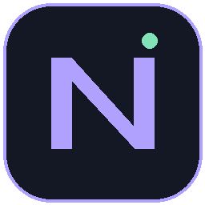
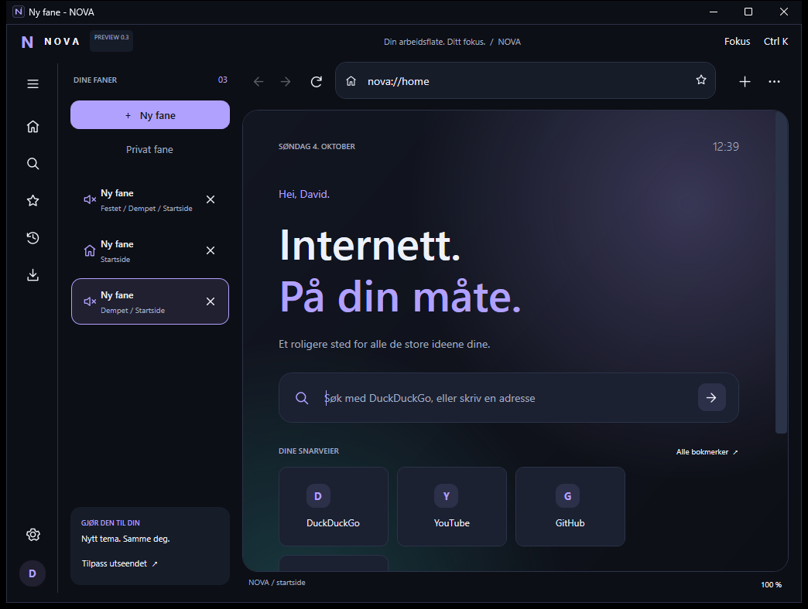
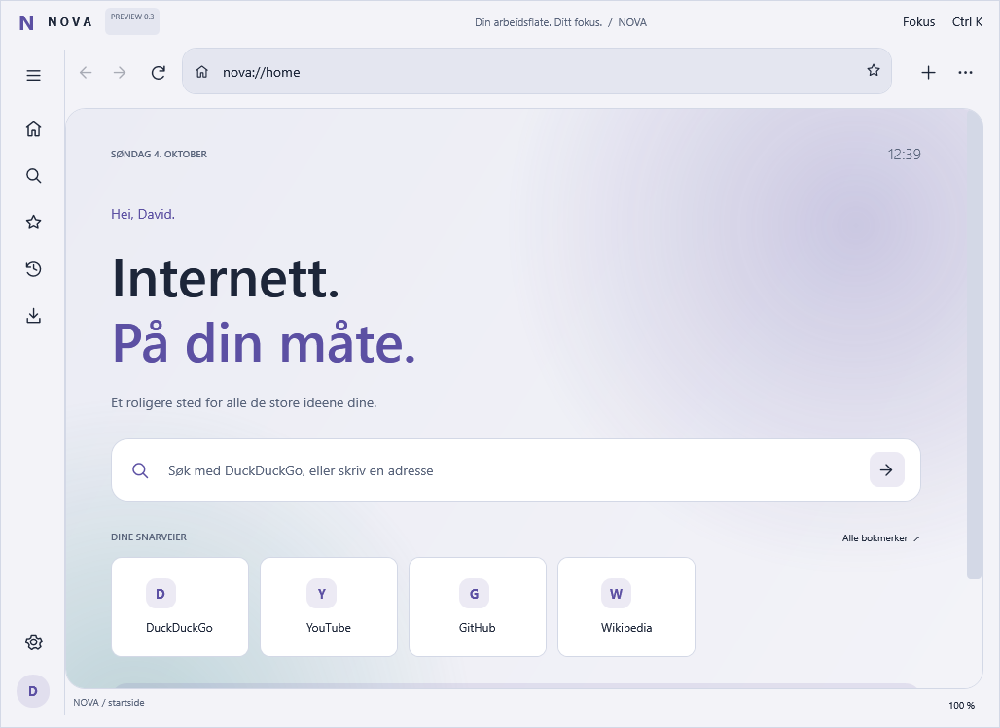
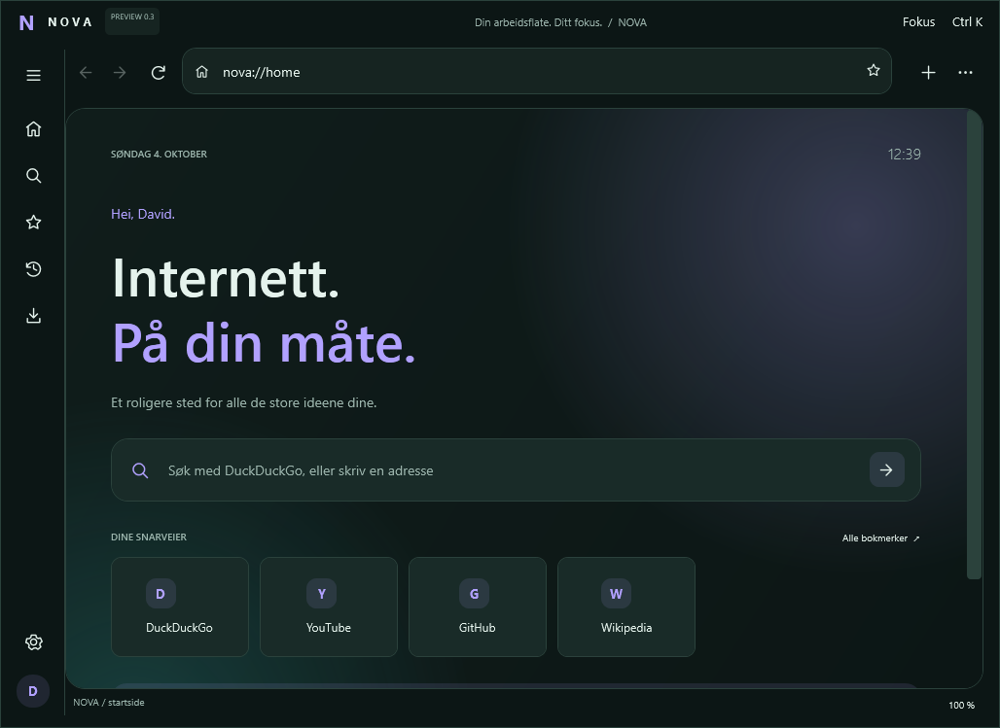
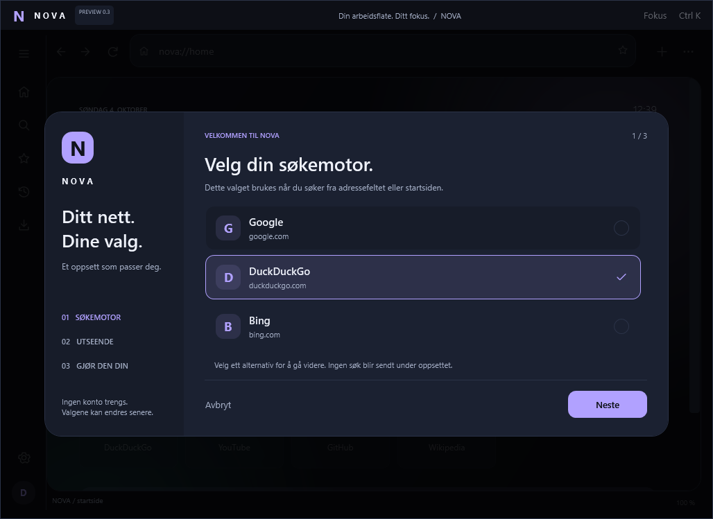
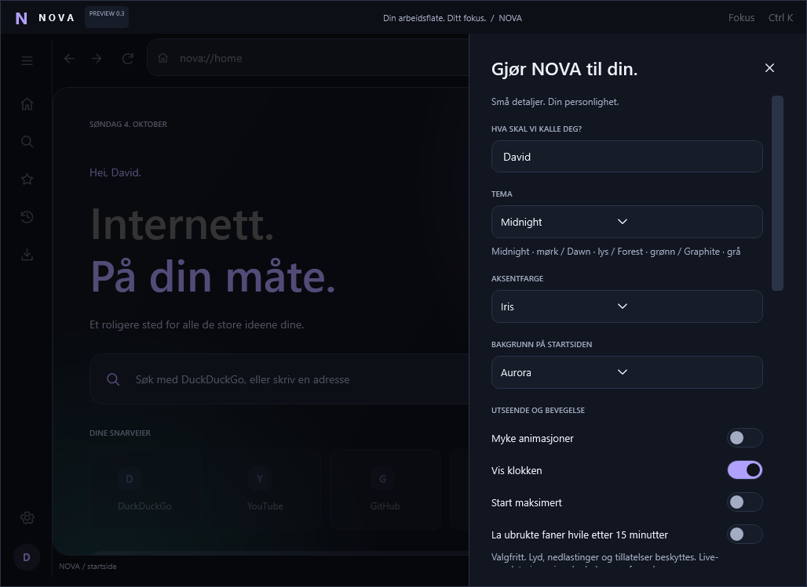

<div align="center">


# NOVA Browser

### Internett. På din måte.

**Et personlig arbeidsområde for nettet. Bygget i Visual Basic .NET.**

[](https://github.com/Darschnid479/NovaBrowser/actions/workflows/windows-build.yml)


[](LICENSE)

[Opplevelsen](#opplevelsen) · [Ekte appbilder](#ekte-appbilder) · [Kom i gang](#kom-i-gang) · [Testbevis](docs/QUALITY-REPORT.md) · [Veikart](docs/ROADMAP.md)
</div>

> **0.3.0 / utviklingsversjon.** Windows-bygging og automatiserte tester er kjørt, inkludert den faktiske nettmotoren. NOVA bruker Microsoft WebView2; dette er ikke en ny nettmotor eller dokumentert raskere/sikrere enn Chrome og Firefox. [Den konkrete valideringskjøringen](https://github.com/Darschnid479/NovaBrowser/actions/runs/37202764701).

## Opplevelsen

NOVA skal være et sted der fanene er ryddige, uttrykket er ditt og vanlige handlinger sitter i fingrene. 0.3.0 prioriterer det som gjør en nettleser brukbar over tid: fungerende vindusbetjening, robust lagring og kontroll over faner og nedlastinger.

| Arbeidsflyt | Personlighet | Pålitelighet |
| --- | --- | --- |
| Fest, flytt, dupliser og demp faner | Fire temaer og seks aksentfarger | Ekte Windows-knapper for lukk, minimer og maksimer |
| Lokale adresseforslag fra faner og bokmerker | Eget førstegangsoppsett | Atomisk profillagring med siste gyldige sikkerhetskopi |
| Nedlastingspanel med pause/fortsett/avbryt | Fokusmodus med `Ctrl+Shift+F` | Spør om gjenoppretting etter unormal avslutning |
| PDF/utskrift og JSON-bokmerkeutveksling | Sidefelt som tilpasses vindusbredden | Isolerte automatiske tester av privat lagring og motorfeil |

**Høyreklikk en fane** for faneverktøyene. Skriv i adressefeltet for lokale forslag; ingenting sendes til en søkeforslagstjeneste mens du skriver. Automatiske hvilende faner er **av som standard** og kan aktiveres i innstillingene. Bakgrunnsoppdateringer kan pauses, og minnebesparelse er ikke garantert.

## Ekte appbilder



Bildene er produsert av den faktiske WPF-appen på en isolert Windows-testmaskin. Filer med `-window` er native PrintWindow-opptak; `-client` er rendering av den levende WPF-klientflaten uten Windows-tittellinjen. Testdata er ikke en virkelig brukers nettleserhistorikk.

<table><tr>
<td width="50%"><b>Dawn</b><br>Lyst tema, samme arbeidsområde.</td>
<td width="50%"><b>Forest</b><br>Et roligere grønt uttrykk.</td>
</tr><tr>
<td><b>Førstegangsoppsett</b><br>Valgene begynner hos deg.</td>
<td><b>Personlig tilpasning</b><br>Tema, søk, økter og ressursvalg.</td>
</tr></table>

[Reell nettmotor som viser en lokal testside](docs/assets/app-0.3.0/nova-03-live-engine.png) · [Kompakt vindu](docs/assets/app-0.3.0/nova-03-compact-client.png) · [Bildeopprinnelse](docs/VISUELT.md).

Designforhåndsvisningene i `docs/assets/previews/` er beholdt som et historisk 0.2.0-arkiv: hver slik HTML-rekonstruksjon er **ikke skjermbilde fra Windows-appen**. De nye 0.3.0-bildene over er ikke HTML-rekonstruksjoner.

## Kom i gang

**Ferdig Windows-pakke:** Pakk ut hele mappen, behold alle DLL-filer ved siden av `NOVA.exe`, og start `NOVA.exe`. Den publiserte utviklingspakken inkluderer .NET, men trenger Microsoft WebView2 Runtime separat. Den er usignert og er ikke en ferdig offentlig stabil utgivelse.

**Fra kildekode:** Windows x64, .NET 10 SDK og WebView2 Runtime kreves. Åpne `NOVA.sln` i Visual Studio, eller kjør:

```powershell
git clone https://github.com/Darschnid479/NovaBrowser.git
cd NovaBrowser
.\START-NOVA.cmd
```

På utviklingsgrenen: `git switch work/nova-0.3.0`. Hovedgrenen endres først ved gjennomgått sammenslåing av endringene.

| Fil | Bruk |
| --- | --- |
| `START-NOVA.cmd` | Kontroller, bygg og start. |
| `BYGG-EXE.cmd` | Lag selvstendig Windows x64-mappe i `out/win-x64`. |
| `TEST-ALT.cmd` | Bygg, kjør modell-/WPF-tester og valgfri faktisk nettmotortest. |
| `SE-NETTSIDEN.bat` | Forhåndsvis den medfølgende landingssiden. |
| `LAST-OPP-NOVA-TIL-GITHUB.bat` | Vis endringer og last opp først etter at du skriver `JA`. |
| `TA-EKTE-SKJERMBILDE.bat` | Ta og godkjenn et bilde fra din egen NOVA. |

**Oppgradering:** Lukk gammel NOVA. Ta gjerne en lokal sikkerhetskopi av `%LOCALAPPDATA%\NOVA-Browser` mens programmet er lukket. Ikke last opp profilen. Pakk ut programmet i en ny mappe uten gamle `bin`, `obj` eller `out`. Eksisterende innstillinger og bokmerker brukes videre. Ikke slett profilen for å oppgradere.

## Tastaturet ditt er en snarvei

| Handling | Tast |
| --- | --- |
| Ny / lukk fane | `Ctrl+T` / `Ctrl+W` |
| Privat / gjenåpne vanlig fane | `Ctrl+Shift+N` / `Ctrl+Shift+T` |
| Adresse / kommandoer | `Ctrl+L` / `Ctrl+K` |
| Bytt fane | `Ctrl+Tab` / `Ctrl+Shift+Tab` |
| Historikk / nedlastinger | `Ctrl+H` / `Ctrl+J` |
| Sidefelt / fokusmodus | `Ctrl+B` / `Ctrl+Shift+F` |
| Skriv ut / lukk vindu | `Ctrl+P` / `Alt+F4` |

## Kvalitet som kan etterprøves

I [den registrerte Windows-kjøringen](https://github.com/Darschnid479/NovaBrowser/actions/runs/37202764701) bestod **407 modell-/policykontroller**, **116 WPF-ikon-/tekstkontroller** og **56 kontroller av faktisk vindu/nettmotor**. Antall kontroller er ikke det samme som antall brukersituasjoner; 256 av policykontrollene dekker kombinasjoner av vilkår for hvilende faner.

Tester bruker egne midlertidige profiler og en HTTP-server bundet til `127.0.0.1`. Motorfeiltesten avslutter kun motorprosessen som tilhører den isolerte testprofilen. Den tester ikke banknettsteder, DRM-strømming, alle nedlastingsdialoger, alle grafikkdrivere eller ytelse mot andre nettlesere.

[Full kvalitetsrapport](docs/QUALITY-REPORT.md) · [Kjente begrensninger](docs/STATUS.md) · [Personvern](docs/PRIVACY.md) · [Arkitektur](docs/ARKITEKTUR.md) · [Endringslogg](CHANGELOG.md).

## Videre retning

Ambisjonen er å fortjene en plass ved siden av etablerte nettlesere. Før neste milepæl prioriteres hverdagsnettsteder, DPI/tilgjengelighet, nedlastingsdialoger, signert distribusjon og målbare ytelsestester. Fanegrupper, flere vinduer, synkronisering, passordbehandler og utvidelser er ikke levert i 0.3.0.

[Bidra](CONTRIBUTING.md) · [Rapporter en feil](https://github.com/Darschnid479/NovaBrowser/issues/new/choose) · [Sikkerhet](SECURITY.md) · [MIT-lisens](LICENSE).
