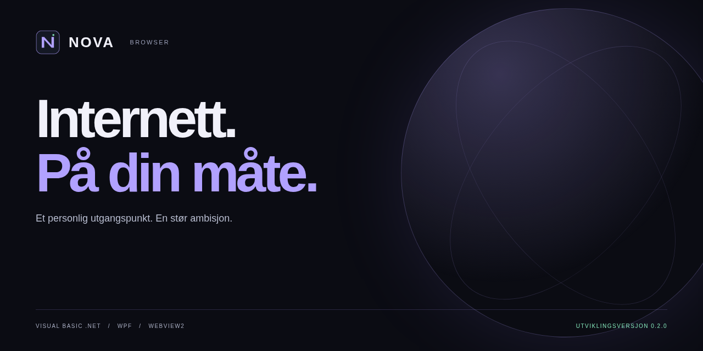
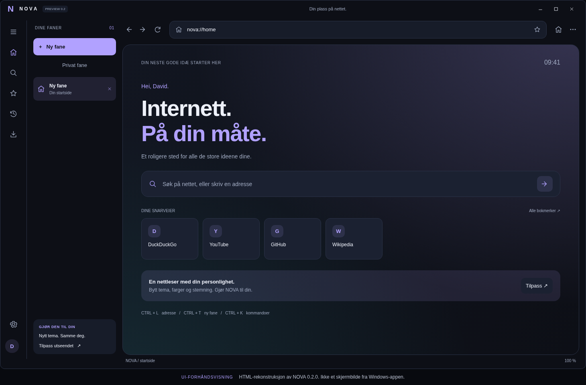
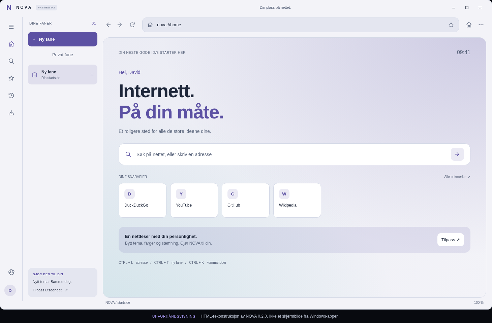
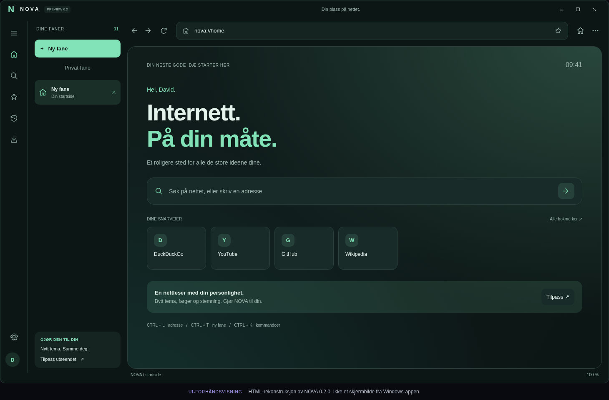
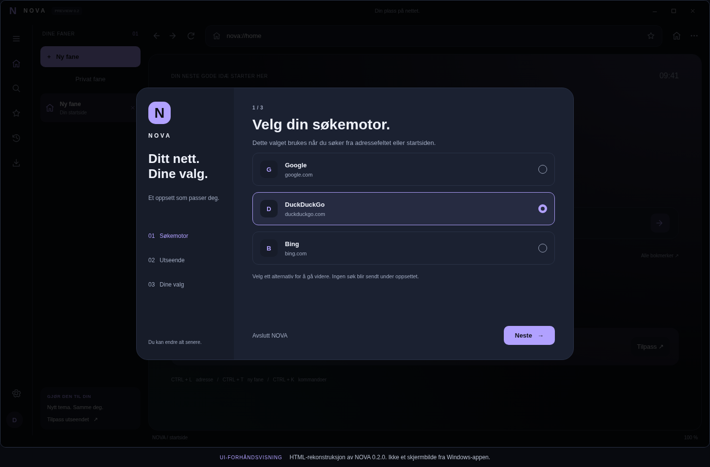
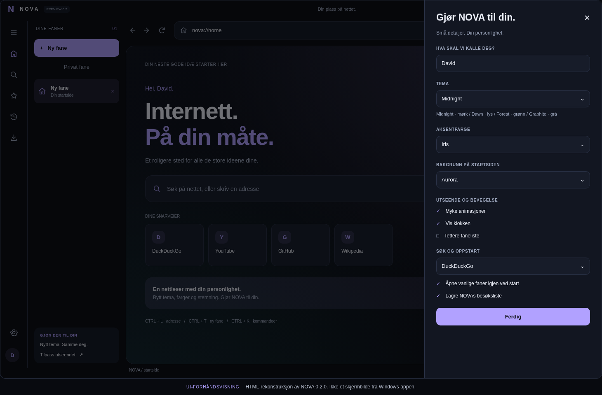

<div align="center">



# NOVA Browser

**En personlig Windows-nettleser. Et tydelig eget uttrykk.**

[](https://github.com/Darschnid479/NovaBrowser/actions/workflows/windows-build.yml)
[](https://github.com/Darschnid479/NovaBrowser/actions/workflows/site-checks.yml)


[](LICENSE)

[Opplevelsen](#opplevelsen) &nbsp; / &nbsp; [Bilder](#bilder) &nbsp; / &nbsp; [Kom i gang](#kom-i-gang) &nbsp; / &nbsp; [Veikart](docs/ROADMAP.md) &nbsp; / &nbsp; [Bidra](CONTRIBUTING.md)

</div>

> **Status: 0.2.0 / utviklingsversjon.** Appen er et VB.NET/WPF-grensesnitt rundt Microsoft WebView2, ikke en ny nettmotor. Byggeindikatorene viser faktiske GitHub Actions-resultater når workflowene er kjørt. Ingen påstand om bedre ytelse eller sikkerhet enn Chrome og Firefox er dokumentert.

## Opplevelsen

En nettleser er et sted du tilbringer mye tid. NOVA utforsker hvordan dette stedet kan bli mer personlig, med synlige faner, et rolig arbeidsområde og innstillinger som starter med dine valg.

**Ambisjonen er å bli et alternativ du vil velge fremfor Chrome og Firefox.** Først må NOVA fortjene den plassen gjennom pålitelighet, god betjening og etterprøvbar testing.

| Oversikt | Personlighet | Dine valg |
| --- | --- | --- |
| Vertikale faner og private faner | Midnight, Dawn, Forest og Graphite | Google, DuckDuckGo eller Bing |
| Gjenåpne lukkede vanlige faner | Seks aksentfarger og tre bakgrunner | Veiviser ved første oppstart |
| Bokmerker og lokal besøksliste | Animasjoner som kan slås av | Gjenoppretting av vanlige faner |
| Kommandofelt med `Ctrl+K` | Personlig navn og klokke | Innstillinger lagres lokalt |

Dette beskriver **implementert kildekode**, ikke en erklæring om at alle funksjoner er ferdig testet. Se [status og kjente begrensninger](docs/STATUS.md).

## Bilder

### Startside / Midnight



**Designforhåndsvisning, ikke skjermbilde fra Windows-appen.** Rekonstruert i HTML med utgangspunkt i XAML, ikonformene og fargepaletten i 0.2.0. Den faktiske appen kan se annerledes ut; kjente problemer med vindusknapper er ikke verifisert rettet.

<table>
<tr>
<td width="50%"><b>Dawn</b><br>Lyst uttrykk / HTML-rekonstruksjon.</td>
<td width="50%"><b>Forest + Mint</b><br>Grønn palett / HTML-rekonstruksjon.</td>
</tr>
<tr>
<td width="50%"><b>Førstegangsoppsett</b><br>Søkemotorvalg / HTML-rekonstruksjon.</td>
<td width="50%"><b>Innstillinger</b><br>Personlig tilpasning / HTML-rekonstruksjon.</td>
</tr>
</table>

**Ekte skjermbilder av landingssiden:** [PC](docs/assets/screenshots/website-desktop.png) / [Mobil](docs/assets/screenshots/website-mobile.png). Disse er tatt ved rendering av den medfølgende nettsiden, ikke av NOVA-appen. [Bildeopprinnelse og fremgangsmåte](docs/VISUELT.md).

For ekte appbilder: start NOVA på Windows og kjør `TA-EKTE-SKJERMBILDE.bat`. Bildet må godkjennes før det flyttes til den publiserbare mappen.

## Kom i gang

### Bygg og prøv appen

Du trenger Windows x64, [.NET 10 SDK](https://dotnet.microsoft.com/download/dotnet/10.0) og [Microsoft WebView2 Runtime](https://developer.microsoft.com/microsoft-edge/webview2/). Bruk en Windows-utgave som fortsatt mottar relevante sikkerhetsoppdateringer.

```powershell
git clone https://github.com/Darschnid479/NovaBrowser.git
cd NovaBrowser
.\START-NOVA.cmd
```

Nedlastet ZIP? Pakk ut **hele** arkivet og dobbeltklikk `START-NOVA.cmd`. Ikke kjør filer direkte inne i ZIP-vinduet.

| Fil | Bruk |
| --- | --- |
| `START-NOVA.cmd` | Kontroller, bygg og start appen. |
| `BYGG-EXE.cmd` | Publiser en komplett Windows x64-mappe til `out\win-x64`. |
| `TEST-NOVA.cmd` / `TEST-UI.cmd` | Kjør modell-/adressekontroller og Windows UI-kontroller. |
| `SE-NETTSIDEN.bat` | Åpne landingssiden lokalt. Ingen bygging nødvendig. |
| `LAST-OPP-NOVA-TIL-GITHUB.bat` | Vis endringer, be om godkjenning og last opp kildepakken. |
| `TA-EKTE-SKJERMBILDE.bat` | Ta og godkjenn ett ekte bilde av NOVA-vinduet. |

**Kildepakken inneholder ikke en testet EXE, installasjonsfil eller medfølgende runtime.** En publisering med `--self-contained true` inkluderer .NET i resultatmappen, men WebView2 Runtime er fortsatt et eget krav. Behold alle filene i `out\win-x64` samlet.

### Last opp til GitHub

`LAST-OPP-NOVA-TIL-GITHUB.bat` er satt opp for **Darschnid479/NovaBrowser**. Den bruker Git på PC-en og lager en separat, midlertidig arbeidskopi av repoet. Deretter legger den inn kildepakken og viser hvilke filer som endres. Skriv `JA` for å godkjenne.

Den endrer ikke din eksisterende lokale Git-historikk, bruker ikke force-push, og sletter ikke filer som bare finnes på GitHub. Filer med samme navn kan oppdateres **etter godkjenning**. Ved avvist push stopper den. Filtrering og en enkel hemmelighetskontroll erstatter ikke din egen gjennomgang.

[Full opplastingsveiledning](docs/maintainers/UPLOAD.md) / [Aktiver GitHub Pages](docs/maintainers/GITHUB-SETUP.md).

## Hurtigtaster

| Handling | Tast |
| --- | --- |
| Ny fane / lukk fane | `Ctrl+T` / `Ctrl+W` |
| Privat fane / gjenåpne lukket vanlig fane | `Ctrl+Shift+N` / `Ctrl+Shift+T` |
| Adresse / kommandoer | `Ctrl+L` / `Ctrl+K` |
| Bytt fane | `Ctrl+Tab` / `Ctrl+Shift+Tab` |
| Bokmerke / historikk / nedlastinger | `Ctrl+D` / `Ctrl+H` / `Ctrl+J` |
| Vis eller skjul sidefelt | `Ctrl+B` |

## Bygget med

```text
NOVA.sln
src/NovaBrowser/       VB.NET-appen, XAML, ikoner, innstillinger og nettmotorintegrasjon
  UI/                  Felles stiler og temafarger
  Services/            Adressepolicy, søkeleverandører, lagring og feillogg
  Models/              Faner, veiviser og lokal tilstand
tests/                 Adresse-/modellkontroller, WPF UI-kontroller, opplastingstester
docs/                  Landingsside, visuelle ressurser og prosjektdokumentasjon
tools/                 Opplasting, skjermbildeverktøy og kildekontroll
.github/               Bygging, nettsjekk, Pages, releasekladd og saksmaler
```

[Arkitektur](docs/ARKITEKTUR.md) / [Personvern](docs/PRIVACY.md) / [Sikkerhet](SECURITY.md) / [Endringslogg](CHANGELOG.md).

## Veien videre

**Nå:** dokumentere og stabilisere funksjonene i 0.2.0. **Neste:** verifisere vindusbetjening, skalering, tastaturflyt og nettleserøkter. **Senere:** vurdere fanegrupper, sovende faner, signerte utgivelser og oppdateringer.

Passordbehandler, utvidelsesbutikk, synkronisering, automatisk appoppdatering og ferdig installasjonsprogram er **ikke inkludert**. Se [veikart med kvalitetskrav](docs/ROADMAP.md); ingen frister er lovet.

## Bidra

Rapporter en konkret feil med versjon, Windows-versjon og trinn som gjenskaper problemet. Ikke legg ved passord, tokens, profilmappen eller en uredigert privat feillogg. [Bidragsveiledning](CONTRIBUTING.md) / [Ny sak](https://github.com/Darschnid479/NovaBrowser/issues/new/choose).

## Lisens

[MIT](LICENSE). Appens eksisterende lisens er beholdt. .NET, WebView2 og andre avhengigheter har egne vilkår. Ingen fontfiler er inkludert.

---

<div align="center"><b>NOVA Browser</b><br>Et personlig utgangspunkt. En stor ambisjon.</div>
